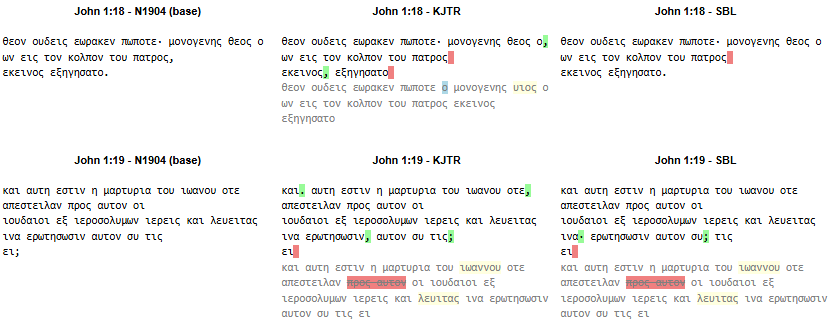

# Textual source comparision

This repository contains a collection of notebooks that facilitated the creation of an overview of alternative punctuations in the Greek text of the Gospel of John. The alternatives were derived from the presence of punctuation marks in parallel Greek source texts, which exhibit textual variations. A matching algorithm was employed to identify optional punctuations.

## Greek input texts

The following data versions are examined. Links to the corresponding notebooks are provided, which were used to preprocess the data into a uniform format suitable for analysis.

- [N1904 - Eberhard Nestle’s 1904 Greek New Testment](N1904/prepare_N1904.ipynb)
- [KJTR - King James Textus Receptus](KJTR/prepare_KJTR.ipynb)
- [SR - Statistical Restoration Greek New Testament](SR/prepare_SR.ipynb)
- [SBL - Society of Biblical Literature Greek New Testment](SBL/prepare_SBL.ipynb)
- [TCGNT - Text-Critical Greek New Testament](TCGNT/prepare_TCGNT.ipynb)
- [TISCH - Tischendorf's 8th edition](TISCH/prepare_TISCH.ipynb)

The output of these notebooks generate the following files:

- XX-John.txt : a normalized (lower case, diacritics removed) Greek base text of the Gospel as one string
- XX-John-tagged.txt : the same text, with verse tags, with each verse on a single line
- XX-John.json : JSON data with each entry containing a verse tag and the normalized of that verse 

The N1904 preparation notebook generates also a JSON file that maps verses to node numbers (words), providing a reference for subsequent analysis.

To reproduce the results, execute the notebooks in this section before running the analysis notebooks described in the next section.

## The analysis notebooks

The main analysis is done in the following jupyter notebook:

- [sourcecomparing.ipynb](sourcecomparing.ipynb): This notebook performs three key tasks. Firstly, it combines the JSON data from individual text versions generated in the previous section. Secondly, it identifies differences between the N1904 base text and the other source texts. Finally, it generates a downloadable table that displays, for each verse and source text, the insertion of punctuation marks from other texts into the N1904 text. In cases of textual differences, the variations are displayed below the verse in gray.

## Results

The resulting table is downloadable and the file is found [here](John_versions.html).

Partial screenshot:

