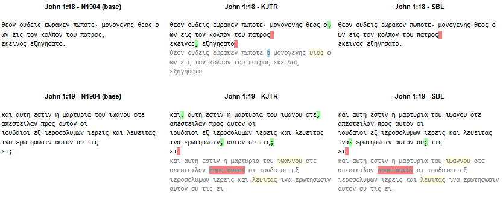

# Textual source comparision

This repository contains a collection of Jupyter notebooks used to generate an overview of *possible* alternative punctuations in the Greek text of the Gospel of John, based on the [Nestle 1904, seventh edition (1913 reprint)](https://sites.google.com/site/nestle1904/home). These alternative punctuations were identified by analyzing punctuation marks in parallel Greek source texts. Because these sources may also contain textual variations beyond punctuation, a tunable matching algorithm was applied to align the texts accurately. For implementation details, see the notebook [sourcecomparing.ipynb](sourcecomparing.ipynb).

## Greek input texts

The following textual versions were used as input, with links provided to the corresponding preprocessing notebooks. These notebooks transform each source into a standardized format suitable for subsequent analysis.

- [N1904 - Eberhard Nestle’s 1904 Greek New Testment](N1904/prepare_N1904.ipynb)
- [KJTR - King James Textus Receptus](KJTR/prepare_KJTR.ipynb)
- [SR - Statistical Restoration Greek New Testament](SR/prepare_SR.ipynb)
- [SBL - Society of Biblical Literature Greek New Testment](SBL/prepare_SBL.ipynb)
- [TCGNT - Text-Critical Greek New Testament](TCGNT/prepare_TCGNT.ipynb)
- [TISCH - Tischendorf's 8th edition](TISCH/prepare_TISCH.ipynb)

Each of these notebooks generate  a set of files like detailed below:

- XX-John.txt : a normalized (lower case, diacritics removed) Greek base text of the Gospel as one string.
- XX-John-tagged.txt : the same text, with verse tags, with each verse on a single line.
- XX-John.json : JSON data with each entry containing a verse tag and the normalized of that verse.

The N1904 preparation notebook generates also a JSON file that maps verses to node numbers (words), providing a reference for subsequent analysis.

## The analysis notebooks

After executing all the above notebooks this section performs the analisys and creates the final HTML data for the punctuation browser.
The main analysis is done in the following jupyter notebook:

- [sourcecomparing.ipynb](sourcecomparing.ipynb): This notebook performs three key tasks. Firstly, it combines the JSON data from individual text versions generated in the previous section. Secondly, it identifies differences between the N1904 base text and the other source texts. Finally, it generates a downloadable table that displays, for each verse and source text, the insertion of punctuation marks from other texts into the N1904 text. In cases of textual differences, the variations are displayed below the verse in gray.

## Results

The resulting table is downloadable and the file is called [John_versions.html](https://tonyjurg.github.io/John-punctuation-browser/John_versions.html).

Partial screenshot:

